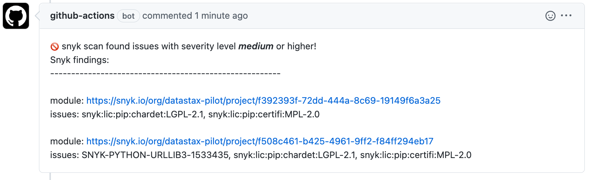
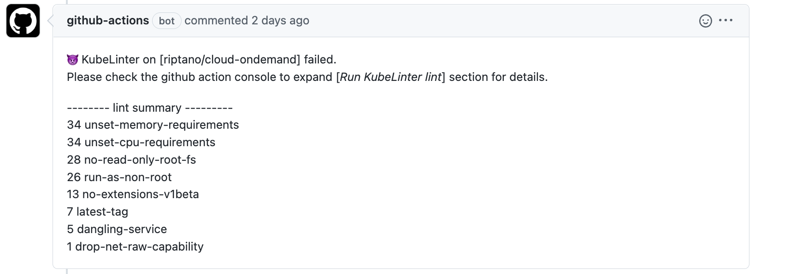

# shared-github-actions   
  
This repo contains common workflow [GitHub Actions](https://github.com/features/actions) code that used in many DataStax git repositories under riptano organization.

## Why use shared code
We use very similar CI/CD pipelines cut across many riptano git repositories. Examples are **security scan**, **code quality** control and many more in the future.  Using common shared code with custom configuration for different repositories helps us to promote code consistency across our whole organization, to eliminate/reduce redudant code and to cut cost of code maintenance.

## Type of the shared code
There are two types of shared GitHub Actions code used:
 - **Composite Action (fine-grained)**

     A composite action is presented as one “step” when it is invoked in a workflow, even if the action yaml contains multiple steps. Invoking a reusable workflow presents each step separately in the summary output. 

 - **Reusable Workflows (coarse-grained)**

     Rather than copying and pasting from one workflow to another, you can make workflows reusable. You and anyone with access to the reusable workflow can then call the reusable workflow from another workflow.

## Shared code
### Snyk scan
  - **Composite Action**  
        actions/snyk-prepare  
        actions/snyk-process-scan-results  
        actions/snyk-scan-go  
        actions/snyk-scan-java  
        actions/snyk-scan-node  
        actions/snyk-scan-python  

  - **Reusable Workflows**  
        .github/workflow/snyk-pr-cleanup.yml  
### Kube-Linter
  - **Reusable Workflows**  
        .github/workflow/kubelinter-lint.yml  
  - **Common configuration**   
        kube-linter-config.yaml  

## Example of how to use shared code
  - **Composite Action**  
    https://github.com/riptano/cloud-ondemand/blob/master/.github/workflows/snyk-cli-scan.yml
  - **Reusable Workflows**  
    https://github.com/riptano/cloud-ondemand/blob/master/.github/workflows/snyk-pr-cleanup.yml

## Sample output of Snyk 
Sample Git Pull Request with Snyk finding summary:    
  

## Sample output of KubeLinter 
Sample Git Pull Request with KubeLinter finding summary:    
  
[sample KubeLinter output](docs/kube-lint-sample-out.txt)  
